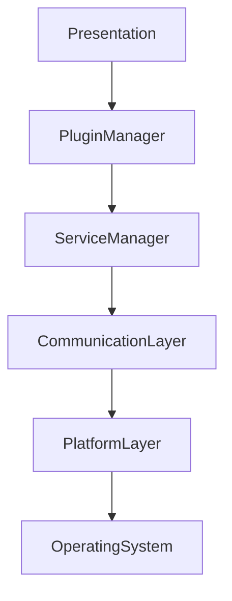
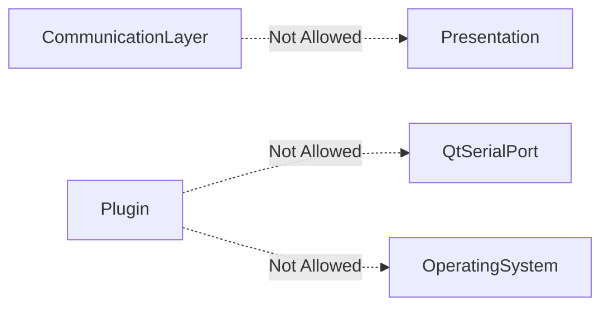

# Open Device Studio Architecture

## Overview

Open Device Studio is a cross-platform, plugin-based desktop application designed for embedded systems, IoT, robotics, and industrial development.

The application follows a modular, layered architecture that allows new features to be added as independent plugins while keeping the core lightweight and maintainable.

---

# Goals

- Cross-platform
- Plugin-first
- High Performance
- Easy to Extend
- Easy to Test
- Community Friendly
- Long-term Maintainability

---

# High-Level Architecture
```text

+------------------------------------------------+
|                 Presentation Layer             |
| Qt Widgets / QML / Dock Panels / Menus         |
+------------------------------------------------+
|                Workspace Layer                 |
| Layout Manager / Session Manager               |
+------------------------------------------------+
|                 Plugin Manager                 |
| Plugin Loader / Lifecycle / Event Bus          |
+------------------------------------------------+
|                Service Layer                   |
| Serial / MQTT / BLE / CAN / Modbus / OTA       |
+------------------------------------------------+
|             Communication Layer                |
| QtSerialPort / SocketCAN / BLE / TCP           |
+------------------------------------------------+
|             Hardware Abstraction               |
| Windows / Linux / macOS APIs                   |
+------------------------------------------------+
```
---

# Layer Responsibilities

## Presentation Layer

Responsible for

- Main Window
- Dock Widgets
- Menus
- Toolbars
- Themes
- User Interaction

Never communicates directly with hardware.

---

## Workspace Layer

Responsible for

- Window Layout
- Saved Sessions
- User Preferences
- Workspace Files

---

## Plugin Manager

Responsible for

- Discover Plugins
- Load Plugins
- Initialize Plugins
- Shutdown Plugins
- Plugin Registry

---

## Service Layer

Provides reusable services such as

- Serial
- MQTT
- BLE
- CAN
- Modbus
- OTA

These services are accessed through interfaces.

---

## Communication Layer

Handles protocol implementations.

Examples

- QtSerialPort
- SocketCAN
- MQTT Client
- Bluetooth APIs
- TCP
- UDP

---

## Hardware Abstraction Layer

Responsible for operating-system-specific functionality.

Supports

- Windows
- Linux
- macOS

---

# Design Principles

✔ Modular

✔ Plugin First

✔ Cross Platform

✔ Interface Driven

✔ Event Driven

✔ Thread Safe

✔ Dependency Injection

✔ SOLID

✔ Clean Architecture

---

# Dependency Rules

## Allowed Dependencies



## Not Allowed Dependencies



# Communication Flow

User

↓

UI

↓

Plugin

↓

Interface

↓

Service

↓

Communication Layer

↓

Hardware

---

# Future Expansion

The architecture allows adding new plugins without modifying the core.

Examples

- Logic Analyzer
- Oscilloscope
- PLC Studio
- Firmware Manager
- AI Assistant
- Device Dashboard

---

# Summary

Open Device Studio follows a plugin-based, interface-driven architecture designed for scalability, maintainability, and long-term community development.
